# WinnyTool

**A free, open-source Windows system diagnostic, optimization, and security hardening tool.** WinnyTool gives you a complete picture of your system's health — scanning for known vulnerabilities (CVEs), analyzing Blue Screen crashes, detecting performance bottlenecks, auditing your network security, and grading your overall security posture from A+ to F. Every finding comes with one-click fix buttons so you can remediate issues without leaving the app.

Built entirely with Python's standard library. Zero external dependencies. Zero telemetry.


---

## Download

### Option 1: Windows Installer (Recommended)
Download `WinnyTool_Setup.exe` from the [Releases](https://github.com/AES256Afro/WinnyTool/releases) page. Double-click to install — adds Start Menu shortcut, Desktop icon, and uninstaller.

### Option 2: Portable EXE
Download `WinnyTool.exe` from [Releases](https://github.com/AES256Afro/WinnyTool/releases). No installation required — just run it.

### Option 3: Run from Source
```bash
git clone https://github.com/AES256Afro/WinnyTool.git
cd WinnyTool
python winnytool.py
```

> **Tip:** Run as Administrator for full functionality (hardening fixes, service changes, Windows Update actions).

---

## Features

### Dashboard
Your system at a glance. Displays OS version, CPU model, RAM usage, GPU, computer name, and uptime in a clean card layout. Eight quick-action buttons let you launch any scan — CVE, BSOD, Performance, Disk Health, Network, Startup, or a full system scan — without navigating away.

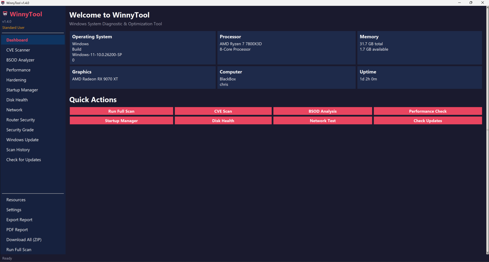

---

### CVE Scanner
Scans your system against a local database of known Windows CVEs (2024-2026) focused on actively exploited vulnerabilities. The scanner cross-references your installed Windows updates and OS build date to avoid false positives — if your cumulative update already covers a CVE, it won't flag it.

Each finding shows:
- **Severity badge** (Critical / High / Medium / Low)
- Description and affected software
- **Suggested fix** with manual instructions
- Three action buttons: **View Advisory** (opens MSRC), **Download KB** (opens Update Catalog), **Open Windows Update**

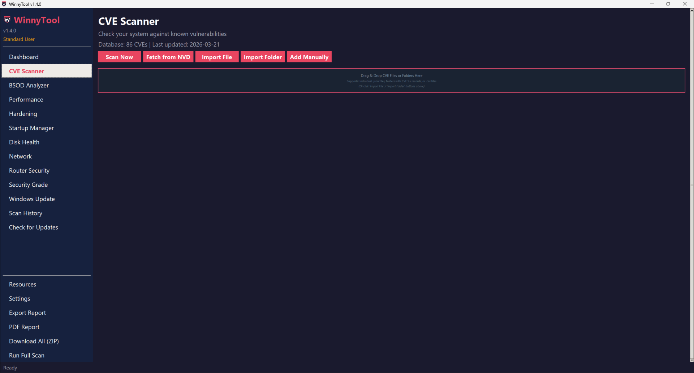

**Expand your database** — fetch from NVD (NIST), import from the CISA KEV feed, drag-and-drop JSON files or folders, or add entries manually through the GUI. Supports the CVE-List repository format. All imports are deduplicated automatically.

---

### Security Grade
An OpenSCAP-style letter grading system that runs all scan modules and produces a weighted composite score from **A+** to **F**.

**7 scoring categories:**
| Category | Weight |
|---|---|
| Windows Updates | 20% |
| CVE Exposure | 20% |
| System Hardening | 20% |
| Network Security | 15% |
| Antivirus & Defender | 10% |
| Account Security | 10% |
| Disk & Data | 5% |

Includes per-category breakdown with score bars, top 5 prioritized recommendations, and an exportable HTML report with copyable fix commands.

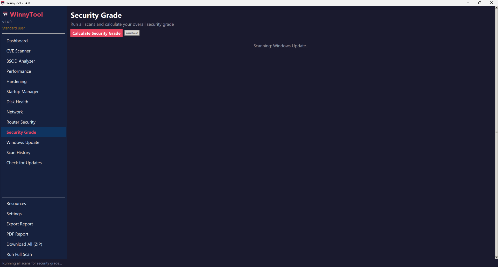

---

### System Hardening
Three tiers of security hardening with full transparency on trade-offs:

| Tier | Checks | For |
|---|---|---|
| **Basic** | 8 | Safe for all users — Firewall, Defender, UAC, SMBv1, auto-updates, screen lock |
| **Moderate** | 10 | Security-conscious users — LLMNR, Credential Guard, BitLocker, audit logging |
| **Aggressive** | 10 | Maximum security — Script Host disable, macro restrictions, NTLM disable, ASR rules |

Every setting shows its **current status**, **pros**, **cons**, and a one-click **Apply Fix** button.

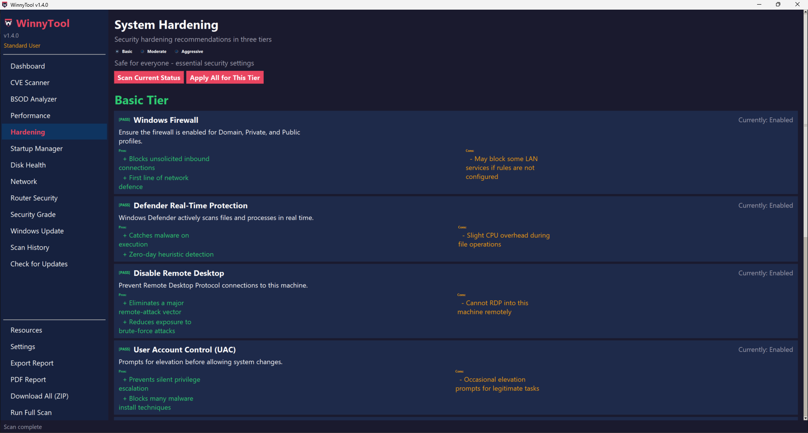

---

### BSOD Analyzer
Pulls the last 10 Blue Screen of Death events from the Windows Event Log and maps **33 known stop codes** (like `KERNEL_POWER`, `DRIVER_IRQL_NOT_LESS_OR_EQUAL`, `CRITICAL_PROCESS_DIED`) to human-readable names with targeted fix suggestions for each.

- Shows timestamps, bug check parameters, and severity levels
- Correlates minidump files from `C:\Windows\Minidump\`
- One-click fix buttons: Open Event Viewer, Open Device Manager, Run SFC Scan, Run DISM Repair, Open Power Options

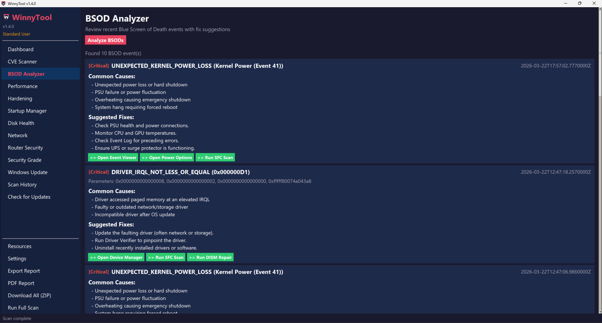

---

### Router & Network Security
Inspired by [RouterSecurity.org](https://routersecurity.org), scans your local network for 16 common weak points:

- **DNS Security** — Secure DNS detection (Cloudflare, Google, Quad9, AdGuard), DNS-over-HTTPS status, DNS leak test
- **Port Scanning** — Scans 13 dangerous ports on your gateway (Telnet, RDP, SNMP, UPnP, backdoor ports)
- **WiFi Security** — Encryption type validation (flags WEP/Open), WPS detection, signal strength
- **Network Exposure** — RDP, SMBv1, network discovery, firewall profile status
- **Privacy** — Proxy settings, hosts file tampering detection

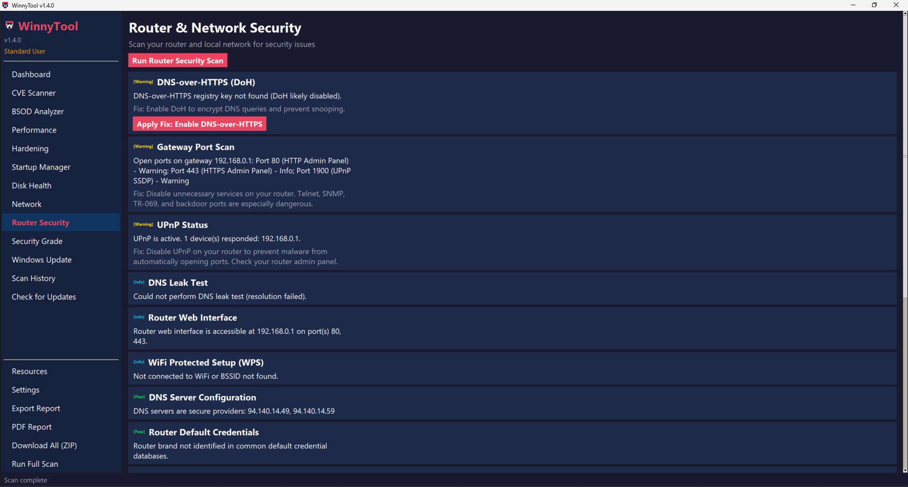

---

### Performance Optimizer
Runs 13 system checks to detect settings that are slowing your PC down. Each finding is rated by impact level (High / Medium / Low) with a one-click fix button.

Checks include: startup program count, visual effects mode, background apps, search indexing, SysMain/Superfetch on SSD, page file configuration, temp file accumulation, Game Mode, transparency effects, tips and suggestions, and more.

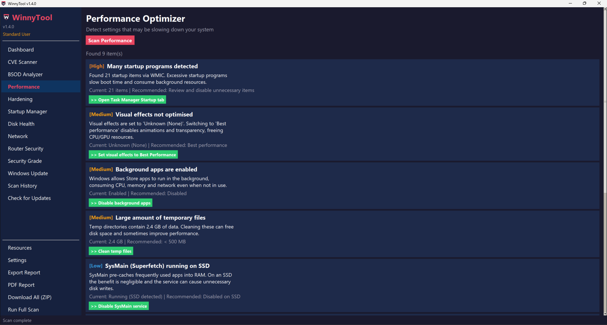

---

### Startup Manager
Scans registry Run/RunOnce keys (HKCU and HKLM), the Startup folder, and scheduled tasks. Each item shows its command path, registry location, and an impact rating based on known resource-heavy applications. Disable or re-enable any startup item directly from the GUI.

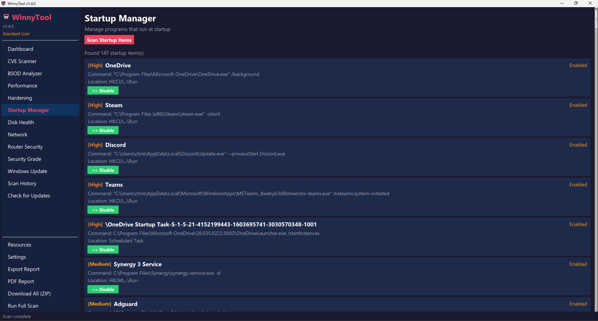

---

### Disk Health
Comprehensive disk diagnostics across all connected drives. Reports disk space usage per partition, SMART health status for each physical drive (HDD and SSD), SSD TRIM enablement, HDD fragmentation levels, and total reclaimable space from temp files, browser caches, Windows Update cache, and the Recycle Bin.

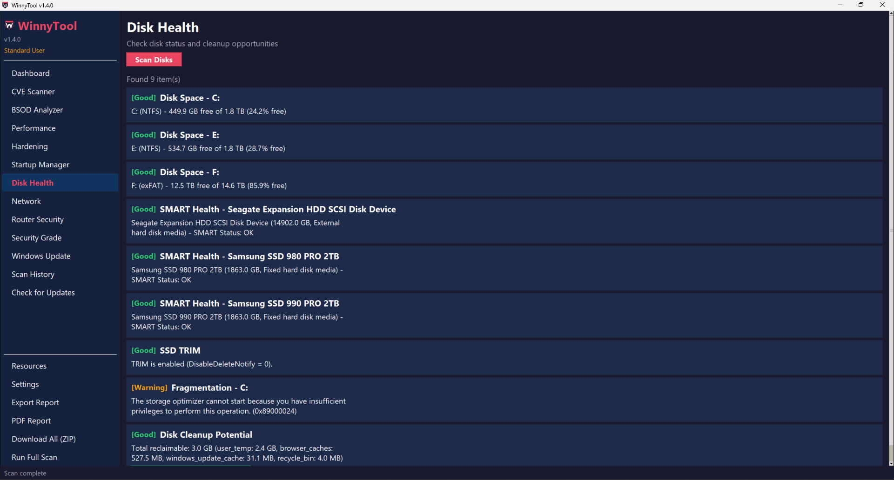

---

### Network Diagnostics
Tests your network stack for misconfigurations and connectivity issues. Checks DNS server configuration (identifies secure providers like Cloudflare and AdGuard), measures latency to multiple endpoints, verifies Windows Firewall status across all profiles, detects proxy settings, inspects the hosts file for suspicious entries, and validates TCP auto-tuning settings.

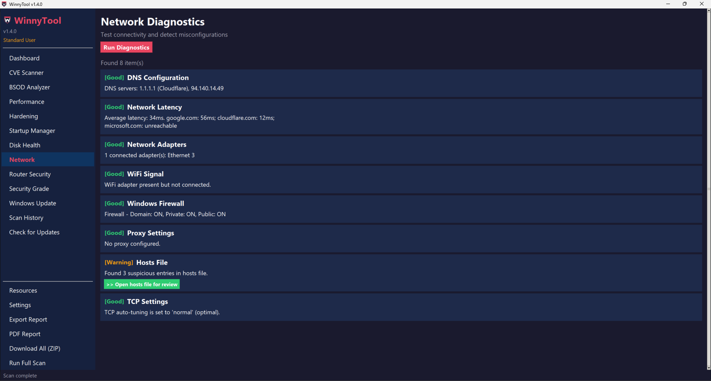

---

### Windows Update Status
Checks your patch posture. Displays current OS build version, last update install date, Windows Update service status, pending updates with KB numbers, feature update status, and recent update history. Includes a one-click button to install pending updates.

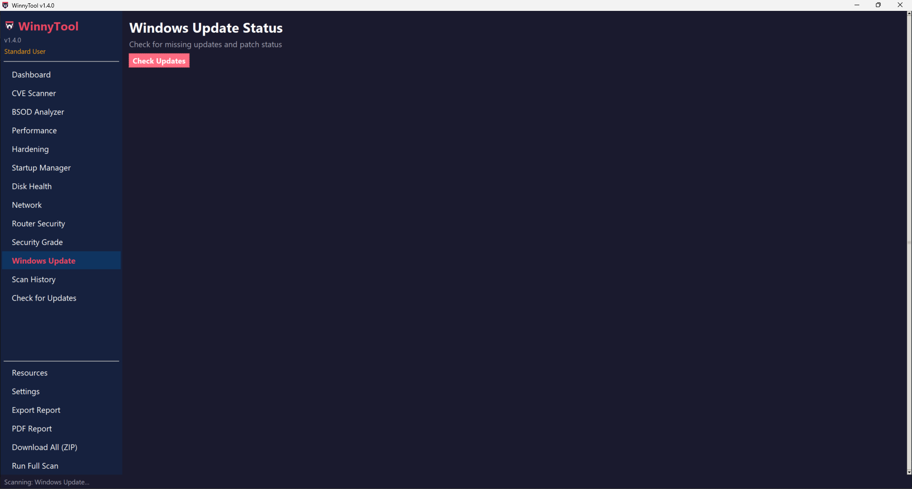

---

### Scan History
Every scan is logged to a local SQLite database with timestamps and finding counts by severity. View previous results across all scan types — Updates, Router Security, Network, Disk, Performance, BSOD, Hardening, Startup, and CVE — to track your system's health over time.

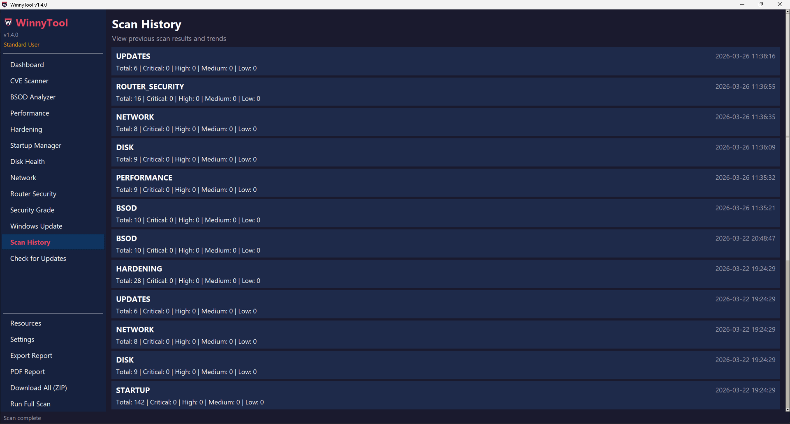

---

### Security Resources
A curated hub of 55+ security links organized by category, all clickable directly from the app:
- **Security Tools** — Shields Up!, VirusTotal, Have I Been Pwned, Shodan, CyberChef, Wireshark, Nmap, Sysinternals Suite, Autoruns, Process Explorer
- **YouTube Channels** — NetworkChuck, John Hammond, The Cyber Mentor, David Bombal, LiveOverflow, IppSec, 13Cubed, Black Hills InfoSec
- **CVE Databases** — NVD (NIST), MITRE CVE, CISA KEV, Microsoft Security Update Guide, Exploit-DB, VulnDB
- **Threat News** — CISA Alerts, Krebs on Security, BleepingComputer, The Hacker News, Dark Reading, SecurityWeek, Ars Technica Security
- **Communities** — r/cybersecurity, r/netsec, r/AskNetsec, r/sysadmin, r/homelab, r/privacy, r/malware, Mac Admins Slack, DFIR Discord, Blue Team Labs, TryHackMe, HackTheBox

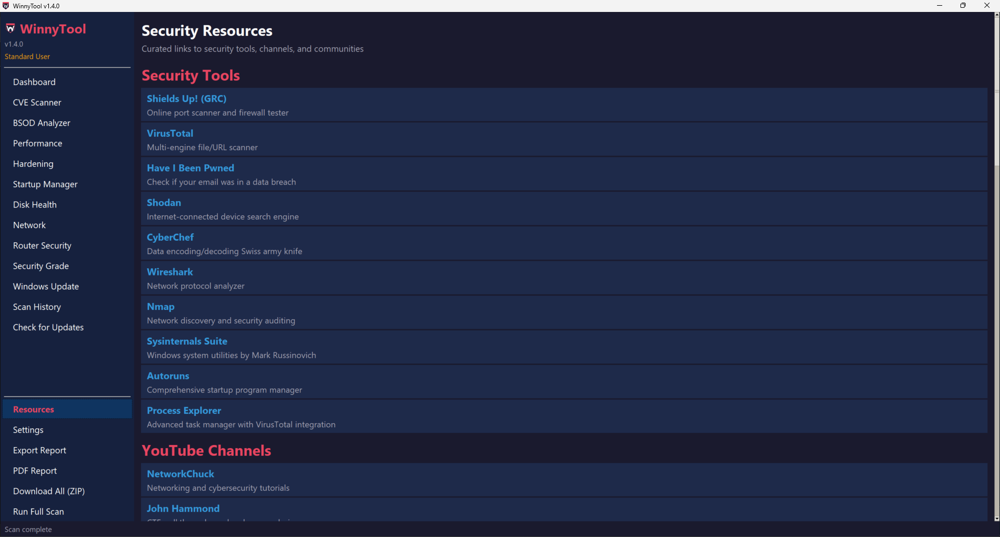

---

### Full System Scan
Run every diagnostic module with a single click. A progress bar tracks each scan phase (CVE, BSOD, Performance, Startup, Disk, Network, Windows Update, Hardening). Once complete, view the total findings summary and export results in multiple formats or drill into any category.

| Format | Description |
|---|---|
| **HTML Report** | Styled dark-themed report, opens in browser |
| **Text Report** | Plain `.txt` file |
| **CSV Export** | Spreadsheet-compatible |
| **PDF Report** | Text-based PDF (zero dependencies) |
| **Download All (ZIP)** | All 4 formats bundled in one `.zip` |

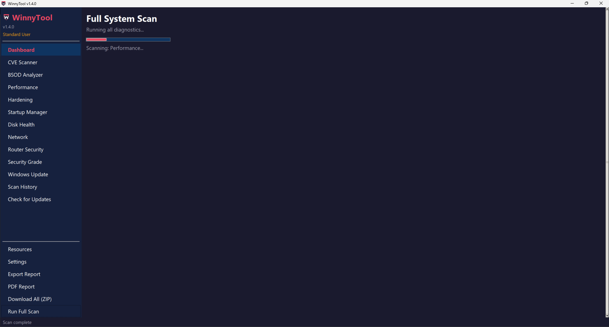

---

### Settings & UI Scaling
Customize the application appearance with preset scaling modes (Compact 80%, Normal 100%, Large 140%) or use the fine-tune slider for any scale up to 200%. Sidebar width adjusts proportionally. Settings persist across sessions.

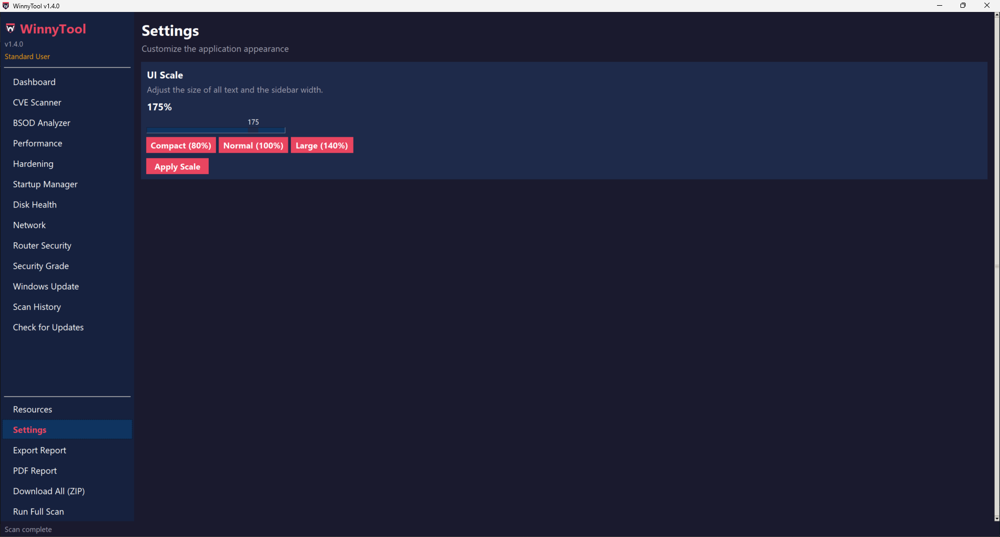

---

### Auto-Updater
Checks the GitHub repository for new WinnyTool releases. Shows your current version and repository source. Downloads and installs updates directly — supports `.zip` extraction, `.exe` and `.msi` launch.

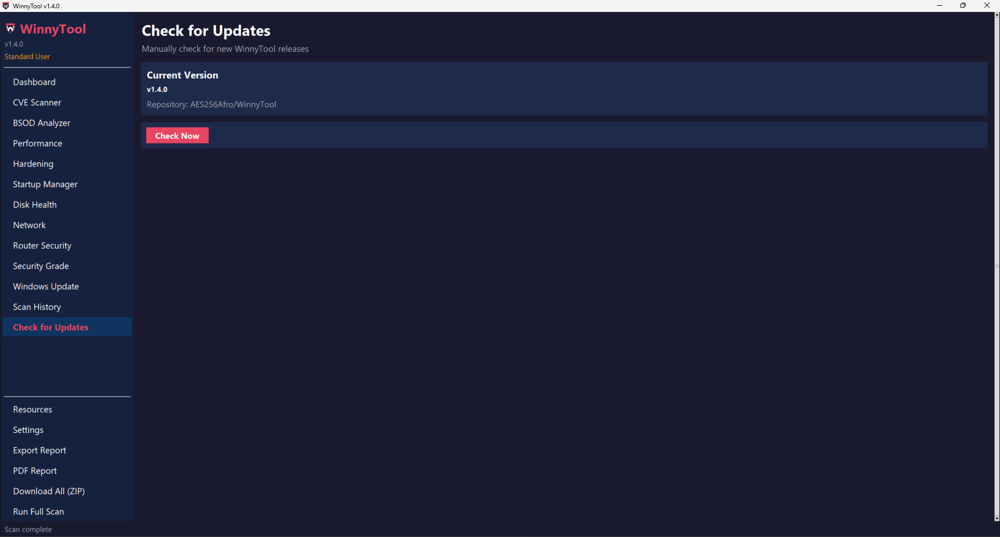

---

## CVE Database Management

WinnyTool ships with 36 built-in CVEs (2024-2026) and supports multiple ways to expand:

| Method | Description |
|---|---|
| **NVD Feed** | Pull from NIST National Vulnerability Database (free API key required) |
| **CISA KEV** | Import actively exploited vulnerabilities from CISA's Known Exploited Vulnerabilities catalog |
| **Manual Entry** | Add custom CVEs through the GUI with full metadata |
| **JSON Import** | Import files matching the WinnyTool schema |
| **Folder Import** | Import entire folders of CVE JSON files (compatible with CVE-List repository) |

All imports are deduplicated automatically.

---

## Project Structure

```
WinnyTool/
├── winnytool.py              # Main GUI application (~3500 lines)
├── build.py                  # PyInstaller build script
├── WinnyTool.spec            # PyInstaller spec file
├── requirements.txt          # Dependencies (stdlib only + optional dev)
├── LICENSE                   # GPL v3
├── core/
│   ├── cve_scanner.py        # CVE database matching + feed import
│   ├── hardening.py          # 3-tier system hardening (28 checks)
│   ├── bsod_analyzer.py      # BSOD event log parsing (33 stop codes)
│   ├── performance.py        # Performance optimization (13 checks)
│   ├── startup_mgr.py        # Startup item management
│   ├── disk_health.py        # Disk diagnostics + cleanup
│   ├── network_diag.py       # Network diagnostics
│   ├── winupdate.py          # Windows Update status
│   ├── router_security.py    # Router & network security (16 checks)
│   ├── grading.py            # Security grading (A+ to F)
│   ├── resources.py          # Curated security resources (55+ links)
│   ├── sysinfo.py            # System information collection
│   ├── updater.py            # GitHub release auto-updater
│   ├── reporter.py           # HTML/Text/CSV/PDF report generation
│   └── history.py            # SQLite scan history
├── data/
│   ├── cve_db.json           # CVE database (36 entries, 2024-2026)
│   └── settings.json         # User preferences (UI scale, etc.)
├── assets/
│   └── winnytool.ico         # Application icon
├── installer/
│   ├── winnytool_setup.nsi   # NSIS installer script
│   ├── inno_setup.iss        # Inno Setup installer script
│   └── BUILD_INSTALLER.md    # Build instructions
├── screenshots/              # README screenshots
└── .github/
    └── workflows/
        └── build.yml         # Auto-build .exe + installer on release
```

---

## Building from Source

### Run directly
```bash
python winnytool.py
```

### Build standalone .exe
```bash
pip install pyinstaller
python build.py
# Output: dist/WinnyTool.exe
```

### Build installer
See [installer/BUILD_INSTALLER.md](installer/BUILD_INSTALLER.md) for full instructions.

---

## Compatibility

- **Windows 10** and **Windows 11** (tested on Build 26200)
- Uses PowerShell CIM instances instead of WMIC (compatible with Win11 builds where WMIC is removed)
- No external Python packages required

---

## License

This project is licensed under the GNU General Public License v3.0 — see the [LICENSE](LICENSE) file for details.

---

## Changelog

### v1.5.0 (2026-03-26)
**New Features:**
- **PDF Report Export** — Generate text-based PDF reports using raw PDF 1.4 syntax, zero external dependencies
- **Download All (ZIP)** — Bundle HTML + Text + CSV + PDF into a single timestamped `.zip` file
- **Full Scan Export Buttons** — HTML Report, Text Report, CSV Export, PDF Report, Download All, Security Grade, and per-category View Details buttons
- **Windows Installer** — Professional NSIS/Inno Setup installer with Start Menu shortcuts, Desktop icon, and Add/Remove Programs entry
- **Standalone .exe** — PyInstaller packaging for single-file portable executable
- **GitHub Actions CI** — Auto-builds `.exe` and installer on new releases

**Improvements:**
- CVE scanner now uses cumulative update date comparison to prevent false positives on fully-patched systems
- AdGuard DNS (94.140.14.x) recognized as secure DNS provider in router security scanner
- Updater silently handles missing releases instead of printing console errors
- Full scan results page now has export and navigation buttons instead of just a summary

### v1.4.0 (2026-03-21)
- Manual fix instructions on CVE findings
- Security Grade HTML report export
- Check for Updates sidebar page
- Auto-update with download and install

### v1.3.0 (2026-03-21)
- Router & Network Security Scanner (16 checks)
- Security Grading System (A+ to F)
- Security Resources Hub (55+ links)

### v1.2.0 (2026-03-21)
- UI Scaling (80%-200% with presets)
- Focused CVE Database (2024-2026 only)
- Dual CVE action buttons (View + Apply Fix)
- Folder/File CVE import

### v1.1.0 (2026-03-21)
- System Hardening (28 checks, 3 tiers)
- CVE Feed Import (NVD, CISA KEV)
- Manual CVE Entry + JSON Import

### v1.0.0 (2026-03-21)
- Initial release
